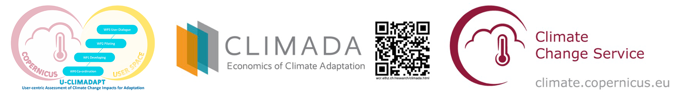

# **Copernicus Seasonal Forecast Tools**


This repository hosts the **copernicus-seasonal-forecast-tools** package, a Python module developed as part of the [U-CLIMADAPT project](https://www.copernicus-user-uptake.eu/user-uptake/details/responding-to-the-impact-of-climate-change-u-climadapt-488).

The module bridges **seasonal forecast data** from the [Copernicus Climate Data Store (CDS)](https://cds.climate.copernicus.eu) with flexible data processing and climate impact modeling workflows. It supports downloading sub-daily Copernicus forecasts and **aggregating them to daily resolution**, enabling analysis of climate indices for impact forecasting.

Users can:
- Convert raw Copernicus seasonal forecasts into usable daily datasets.
- Compute **heat-related climate indices** (e.g., Heatwaves, Tropical Nights).
- Generate **CLIMADA-compatible hazard objects** from processed forecasts.

While not part of the core [CLIMADA](https://climada.ethz.ch/) platform, it is designed for **seamless integration** with CLIMADA for climate impact and risk workflows.

---

## **Documentation**
Coming soon via ReadTheDocs.

---

## **Installation**

You can install **copernicus-seasonal-forecast-tools** in three ways:

### 1. Install via pip (recommended for most users)

```bash
pip install copernicus-seasonal-forecast-tools
```
### 2. Install via conda or mamba
```bash
conda install -c conda-forge copernicus-seasonal-forecast-tools
```
### 3. Install directly from GitHub 
```bash
git clone https://github.com/DahyannAraya/copernicus-seasonal-forecast-tools.git
cd copernicus-seasonal-forecast-tools
pip install .
```
### **CLIMADA Installation**
To create hazard objects from processed forecasts, CLIMADA is required.  

Follow the steps below:
```bash
# Clone and install CLIMADA in development mode

git clone https://github.com/CLIMADA-project/climada_python.git
cd climada_python
pip install -e .
cd ..
python -c "from climada.hazard import Hazard; print('Hazard module successfully imported!')"
```
**Note**
If you want to have all the functionalities of **CLIMADA**, you must install the full version.  
👉 For detailed instructions, follow the official CLIMADA installation guide:  
**[CLIMADA Installation Guide](https://climada-python.readthedocs.io/en/stable/guide/install.html)**

---
## **Example of use**

This repository provides Jupyter Notebooks to work with **CLIMADA** and the **Copernicus seasonal forecast module**.

There are two notebooks available:

- **`Modul_climada_copernicus_seasonal_forecast_workshop.ipynb`**: This is the first notebook to run. It demonstrates how to install and use the `copernicus_interface` module to download, process, and convert seasonal forecast data into a CLIMADA hazard object.
- **`DEMO_Modul_climada_copernicus_seasonal_forecast_workshop.ipynb`**: This is the second notebook. It provides a full example application of the seasonal forecast hazard data in an end-to-end climate impact assessment pipeline.

### Notebooks

| Notebook | Open in Colab | GitHub Link |
|----------|----------------|-------------|
| `Modul_climada_copernicus_seasonal_forecast_workshop.ipynb` | [](https://colab.research.google.com/github/DahyannAraya/climada_copernicus_seasonal_forecast_workshop/blob/main/Modul_climada_copernicus_seasonal_forecast_workshop.ipynb) | [View on GitHub](https://github.com/DahyannAraya/climada_copernicus_seasonal_forecast_workshop/blob/main/Modul_climada_copernicus_seasonal_forecast_workshop.ipynb) |
| `DEMO_Modul_climada_copernicus_seasonal_forecast_workshop.ipynb` | [](https://colab.research.google.com/github/DahyannAraya/climada_copernicus_seasonal_forecast_workshop/blob/main/DEMO_Modul_climada_copernicus_seasonal_forecast_workshop.ipynb) | [View on GitHub](https://github.com/DahyannAraya/climada_copernicus_seasonal_forecast_workshop/blob/main/DEMO_Modul_climada_copernicus_seasonal_forecast_workshop.ipynb) |


---
## **References**
- [Copernicus Seasonal Forecast Module](https://github.com/CLIMADA-project/climada_petals/tree/feature/copernicus_forecast)
- [Seasonal forecast daily and subdaily data on single levels](https://cds.climate.copernicus.eu/datasets/seasonal-original-single-levels?tab=overview)
- [Copernicus Climate Data Store](https://cds.climate.copernicus.eu)
- [CLIMADA Documentation](https://climada.ethz.ch/)
- [U-CLIMADAPT Project](https://www.copernicus-user-uptake.eu/user-uptake/details/responding-to-the-impact-of-climate-change-u-climadapt-488)
