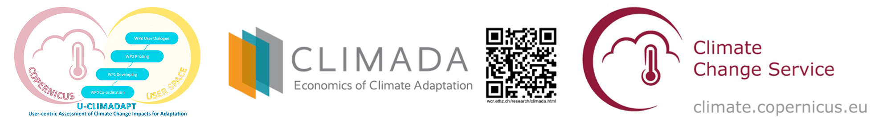

.. Copernicus Seasonal Forecast Tools documentation master file, created by
   sphinx-quickstart on Wed May  7 16:11:16 2025.
   You can adapt this file completely to your liking, but it should at least
   contain the root `toctree` directive.

.. Copernicus Seasonal Forecast Tools documentation master file

Copernicus Seasonal Forecast Tools
==================================

.. raw:: html

   

      
      
      
      
      
   

Overview
--------

Welcome to the **Copernicus Seasonal Forecast Tools**! 

This Python package, developed to manage seasonal forecast data from the `Copernicus Climate Data Store (CDS) <https://cds.climate.copernicus.eu/>`_ as part of the `U-CLIMADAPT <https://www.dwd.de/EN/research/projects/socioeconomics/fpcup_u_climadapt/fpcup_u_climadapt.html>`_ project. We designed this package to make working with climate forecasts more accessible for researchers and practitioners.

It offers comprehensive tools for downloading, processing, computing climate indices, and generating hazard objects based on seasonal forecast datasets, particularly `Seasonal forecast daily and subdaily data on single levels <https://cds.climate.copernicus.eu/datasets/seasonal-original-single-levels?tab=overview>`_.
The package is tailored to integrate seamlessly with the `CLIMADA <https://climada.ethz.ch/>`_ (CLIMate ADAptation) platform, supporting climate risk assessment and the development of effective adaptation strategies.

Key features include:

- Download Copernicus CDS seasonal forecasts (subdaily)
- Convert to daily resolution automatically
- Calculate heat-related climate indices (e.g., Heatwaves, Tropical Nights)
- Integrate with CLIMADA hazard workflows
- Extending functionality through a modular design (e.g., for new indices or forecast products)

Getting Started
---------------

For a quick start, install the package and its requirements

.. code-block:: bash

   pip install copernicus-seasonal-forecast-tools
   git clone https://github.com/DahyannAraya/copernicus-seasonal-forecast-tools.git 
   pip install -r docs/requirements.txt

For detailed installation instructions, see :doc:`Installation <installation>`.

.. note::

   Seasonal forecast data can be accessed through the `Copernicus Climate Data Store (CDS) <https://cds.climate.copernicus.eu>`_, 
   which offers a variety of datasets including those compatible with this tool. **Access requires a free CDS account and proper API configuration.**
   You need a CDS account, API credentials, and to accept the dataset's terms and conditions.
   We've prepared a comprehensive :ref:`CDS API setup guide <cds-api-setup>` to walk you through each step of the process.
   Once configured, you'll be ready to explore and analyze seasonal forecast data.

License
-------

`GPL-3.0 license <https://github.com/DahyannAraya/copernicus-seasonal-forecast-tools/blob/main/LICENSE>`_

.. toctree::
   :maxdepth: 1
   :caption: Contents:
   :titlesonly:

   Home <self>
   Installation <installation>
   Short Example <copernicus_forecast_short.ipynb>
   Full Walkthrough <climada_hazard_copernicus_forecast.ipynb>
   autoapi/index
   How to Cite <citing>
   Contribution <contribution>
   Resources <modules>
